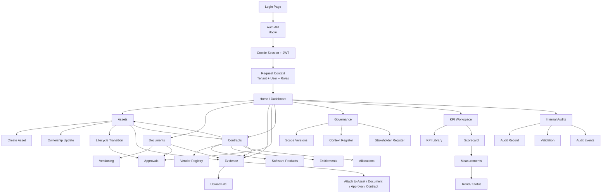

# Alur End-to-End: Login sampai KPI dan Internal Audit

Dokumen ini menjelaskan alur bisnis utama di codebase ITAM SaaS, mulai dari login, bootstrap session, navigasi dashboard, sampai modul KPI dan internal audit.

Fokus dokumen ini adalah:

- Menjelaskan urutan kerja nyata yang dipakai aplikasi.
- Menunjukkan dependensi antar modul.
- Menjelaskan titik kontrol tenant, role, approval, evidence, dan audit trail.
- Memberikan gambaran cepat untuk navigasi source code.

## 1. Gambaran Besar Arsitektur Alur

Sistem ini bergerak dalam pola berikut:

1. User login ke tenant.
2. Backend membuat session berbasis cookie + JWT.
3. Frontend mengambil `me` untuk membaca tenant, user, dan role.
4. Dashboard menampilkan ringkasan operasional dan launcher modul.
5. User masuk ke modul bisnis seperti assets, documents, evidence, contracts, governance, KPI, dan internal audit.
6. Semua perubahan penting menghasilkan audit event dan/atau approval record.

Secara desain, alur ini bukan alur linear tunggal. Ada beberapa cabang workflow yang saling terkait:

- Assets -> ownership -> lifecycle -> approvals -> evidence.
- Documents -> versioning -> approvals -> evidence.
- Contracts -> vendors -> software products -> entitlements -> allocations.
- Governance scope/context/stakeholders -> laporan -> monitoring.
- KPI library -> KPI scorecard -> measurements -> trend.
- Internal audits -> phase gating -> validation -> audit trail.

## 2. Diagram End-to-End

## 3. Flow Login Sampai Dashboard

### 3.1 Login

Urutan login diimplementasikan di frontend login page dan backend auth module.

Langkahnya:

- User mengisi `tenant code`, `email`, `password`, dan captcha token.
- Frontend mengirim request ke `/api/v1/auth/login`.
- Backend memeriksa kredensial, status tenant, dan kondisi kontrak tenant.
- Jika valid, backend mengirim session cookie `itam_at` dan `itam_rt`.
- Frontend lalu melakukan redirect ke homepage.

Kontrol penting:

- Kalau tenant suspended, login ditolak.
- Kalau contract tenant belum aktif atau sudah habis, login ditolak.
- `SUPERADMIN` punya bypass tertentu pada validasi tenant contract di layer auth.

### 3.2 Bootstrap Session

Setelah login, frontend langsung memanggil `/api/v1/auth/me`.

Data ini dipakai untuk:

- Menentukan role user.
- Menentukan tenant aktif.
- Menentukan apakah banner subscription harus tampil.
- Menentukan modul mana yang boleh ditampilkan di homepage.

Jika access token habis:

- `api.ts` mencoba refresh token secara otomatis melalui `/api/v1/auth/refresh`.
- Jika refresh berhasil, request asal diulang.
- Jika refresh gagal, frontend memunculkan event `session-expired` dan guard mengarahkan user ke login.

### 3.3 Dashboard

Homepage bukan sekadar halaman sambutan. Ia menjadi control center:

- Menampilkan summary aset, approval, dokumentasi, evidence, governance, dan scope.
- Menampilkan launcher KPI Workspace.
- Menyediakan quick links ke pembuatan asset, document, evidence, dan halaman penting lain.
- Menampilkan banner subscription jika kontrak tenant berada pada kondisi `EXPIRING`.

## 4. Flow Modul Utama

### 4.1 Assets

Assets adalah pusat data operasional.

Alurnya:

1. User membuka list assets.
2. Frontend mengambil config UI, asset types, dan lifecycle states.
3. User membuat aset baru dengan asset type dan initial state.
4. Backend memvalidasi coverage berdasarkan tipe aset.
5. Setelah aset ada, user bisa membuka detail, mengubah ownership, dan melakukan lifecycle transition.
6. Jika transition memerlukan approval, backend membuat approval record.
7. Asset juga bisa menjadi target evidence, contract relation, software installation, atau transfer request.

Dependensi penting:

- Asset type dan lifecycle state berasal dari master data/config.
- Ownership bergantung pada department, identity, dan location master.
- Lifecycle transition bisa memicu approvals.
- Asset coverage dipakai oleh laporan coverage dan mapping.

### 4.2 Approvals

Approvals adalah modul persetujuan lintas workflow.

Pola utamanya:

- Approval muncul dari proses lain, bukan selalu dibuat manual.
- List approvals menampilkan status `PENDING`, `APPROVED`, atau `REJECTED`.
- User dengan role yang sesuai bisa melihat detail dan mengambil keputusan.

Keterkaitan:

- Lifecycle asset dapat membuat approval.
- Dokumen atau workflow lain juga bisa menggunakan approval sebagai gate.
- Approval yang diputuskan akan berdampak ke state target di workflow asal.

### 4.3 Documents

Documents memakai workflow status dan versioning.

Urutannya:

- User membuat dokumen baru.
- Version 1 dibuat sebagai basis awal.
- Dokumen bergerak dari `DRAFT` ke `IN_REVIEW`, lalu `APPROVED`, `PUBLISHED`, dan `ARCHIVED`.
- Dokumen bisa dihubungkan dengan evidence atau approval.

Poin penting:

- List dokumen memisahkan status agar workflow mudah dipantau.
- Edit umumnya hanya diizinkan pada fase awal seperti `DRAFT` atau `IN_REVIEW`.

### 4.4 Evidence

Evidence adalah library file yang aman.

Urutannya:

- User upload file.
- Backend memeriksa ukuran, tipe file, dan keamanan path.
- File disimpan di storage tenant-specific.
- File bisa didownload kembali dari endpoint download.
- Evidence dapat dihubungkan ke asset, document, approval, atau contract.

Karakter penting:

- Image bisa dioptimalkan otomatis.
- File non-image disimpan apa adanya.
- Modul ini adalah salah satu titik kontrol keamanan file paling ketat.

### 4.5 Contracts, Vendors, Software Products, dan Entitlements

Empat modul ini membentuk rantai supply dan lisensi.

Urutan logisnya:

1. User mendaftarkan vendor.
2. User membuat contract yang mengacu ke vendor.
3. User membuat software product, jika organisasi membeli software tertentu.
4. User membuat entitlement untuk contract tertentu.
5. Entitlement dialokasikan ke asset, installation, atau assignment.

Hubungan antar modul:

- Vendor menjadi basis kontrak.
- Contract health dihitung dari end date dan renewal window.
- Software product memakai vendor publisher sebagai referensi opsional.
- Entitlement dan allocation dipakai untuk analisis pemakaian lisensi dan kepatuhan.

### 4.6 Governance

Governance dibagi ke tiga register:

- Scope versions.
- Context register.
- Stakeholder register.

Fungsi masing-masing:

- Scope versions mendefinisikan ruang lingkup ITAM yang sedang aktif.
- Context register mencatat driver internal atau eksternal yang mempengaruhi keputusan ITAM.
- Stakeholder register mencatat pihak yang berkepentingan dan ekspektasinya.

Pola kerja:

- User bisa create draft.
- User lalu memfilter, review, dan update entri register.
- Scope version memiliki workflow lebih formal: draft, submitted, approved, active, superseded.

### 4.7 KPI Workspace

KPI adalah workspace monitoring performa tenant.

Komponen utama:

- KPI Library.
- KPI Scorecard.
- KPI Measurements.
- KPI Trend.

Alur kerja:

1. User membuka KPI Workspace dari homepage.
2. Frontend membaca role untuk memastikan user boleh melihat modul KPI.
3. KPI Library dipakai untuk mendefinisikan KPI master, target, threshold, kategori, dan sumber data.
4. KPI Scorecard menghitung performa untuk periode monthly, quarterly, atau yearly.
5. User dapat mencatat measurement manual atau membuat snapshot system.
6. Trend dipakai untuk melihat pergerakan KPI dari periode ke periode.

Detail teknis penting:

- `MANUAL` KPI butuh actual value saat capture.
- `SYSTEM` KPI bergantung pada metric source backend.
- Scorecard menampilkan status seperti `ON_TRACK`, `WARNING`, `CRITICAL`, `NO_TARGET`, dan `MISSING`.

### 4.8 Internal Audits

Internal audit adalah domain khusus yang terpisah dari audit trail umum.

Alurnya:

- User membuka modul internal audit.
- Data audit diambil dari route, service, dan repo internal audit yang dedicated.
- Edit dan validasi berjalan mengikuti phase atau state yang ditentukan module.
- Audit menghasilkan catatan terstruktur dan dapat dipakai sebagai jejak pemeriksaan internal.

Perbedaan penting:

- `audit-events` adalah trail sistem umum.
- `internal-audits` adalah domain kerja audit internal yang aktif dan terstruktur.

## 5. Alur Lintas Modul yang Paling Penting

### 5.1 Asset -> Approval -> Evidence

Ini salah satu rantai paling sering dipakai.

- Asset dibuat atau diperbarui.
- Jika ada transition yang membutuhkan persetujuan, approval dibuat.
- Evidence bisa dilampirkan untuk mendukung keputusan.
- Setelah keputusan final, state asset atau workflow terkait diperbarui.

### 5.2 Document -> Approval -> Evidence

- Dokumen dibuat dalam status awal.
- Jika dokumen perlu review formal, approval muncul.
- Evidence bisa dilampirkan sebagai bukti pendukung.
- Dokumen bergerak ke status yang lebih final setelah approval selesai.

### 5.3 Contract -> Vendor -> Software -> Entitlement -> Allocation

- Vendor dibuat sebagai entitas pemasok.
- Contract dibuat mengacu ke vendor.
- Software product dibuat bila ada produk software yang perlu dilacak.
- Entitlement ditautkan ke contract dan product.
- Allocation membagi entitlement ke asset, installation, atau assignment.

### 5.4 Governance -> KPI -> Audit

- Governance scope menentukan area yang berada dalam cakupan.
- Context dan stakeholder menjelaskan alasan bisnis dan pihak yang terdampak.
- KPI mengukur performa tenant terhadap scope tersebut.
- Internal audit memeriksa apakah implementasi dan kontrol berjalan sesuai target.

## 6. Kontrol Akses dan Tenant Isolation

Sistem ini mengandalkan tiga lapisan kontrol:

- Session auth di `/auth`.
- Tenant scoping di `requestContext`.
- Role gate di service dan client UI.

Implikasinya:

- User tidak hanya harus login, tetapi juga harus berada dalam tenant yang benar.
- Banyak halaman web memeriksa role sebelum menampilkan tombol create, edit, atau manage.
- Backend tetap menjadi otoritas final; UI hanya membantu menutup jalur akses yang tidak relevan.

## 7. Urutan Bacaan Kode yang Disarankan

Kalau kamu mau memahami alur ini dari code, urutannya paling efektif adalah:

- [apps/api/src/app.js](/c:/dev/ITAM/apps/api/src/app.js)
- [apps/api/src/modules/auth/auth.service.js](/c:/dev/ITAM/apps/api/src/modules/auth/auth.service.js)
- [apps/api/src/plugins/requestContext.js](/c:/dev/ITAM/apps/api/src/plugins/requestContext.js)
- [apps/web/app/lib/api.ts](/c:/dev/ITAM/apps/web/app/lib/api.ts)
- [apps/web/app/components/AuthGuard.tsx](/c:/dev/ITAM/apps/web/app/components/AuthGuard.tsx)
- [apps/web/app/page.tsx](/c:/dev/ITAM/apps/web/app/page.tsx)
- [apps/web/app/lib/kpi.ts](/c:/dev/ITAM/apps/web/app/lib/kpi.ts)
- [apps/api/src/modules/internal-audits/internal-audit.routes.js](/c:/dev/ITAM/apps/api/src/modules/internal-audits/internal-audit.routes.js)
- [apps/api/src/modules/internal-audits/internal-audit.service.js](/c:/dev/ITAM/apps/api/src/modules/internal-audits/internal-audit.service.js)
- [apps/api/src/modules/internal-audits/internal-audit.repo.js](/c:/dev/ITAM/apps/api/src/modules/internal-audits/internal-audit.repo.js)

## 8. Kesimpulan

Kalau disederhanakan, alur aplikasi ini adalah:

- Login dan tenant bootstrap.
- Dashboard sebagai pusat navigasi.
- Assets sebagai core registry operasional.
- Documents, evidence, approvals, contracts, vendors, dan software sebagai workflow pendukung.
- Governance sebagai layer kontrol ruang lingkup dan konteks.
- KPI sebagai layer pengukuran.
- Internal audit sebagai layer pemeriksaan dan validasi.

Kalau kamu mau, dokumen ini bisa saya pecah lagi menjadi:

- diagram per modul,
- flowchart yang lebih teknis per endpoint,
- atau SOP operasional langkah demi langkah untuk user admin, auditor, dan manager.
