# Diagram Per Modul

Dokumen ini memetakan alur modul satu per satu berdasarkan code yang ada di repo.

Tujuan dokumen ini:

- Membantu kamu melihat hubungan antar modul dengan cepat.
- Menunjukkan dependensi data dan workflow.
- Menjadi jembatan dari pemahaman high-level ke pembacaan source code.

## 1. Auth dan Session

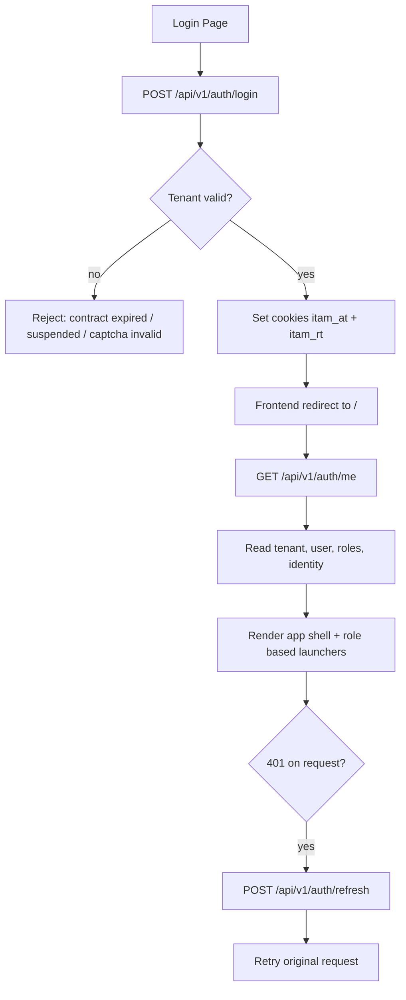

Catatan penting:

- Auth adalah pintu utama semua tenant-scoped request.
- Frontend tidak menyimpan token di localStorage; token session disimpan di cookie httpOnly.
- Refresh token flow ada di client wrapper, bukan di setiap halaman manual.

## 2. Home / Dashboard

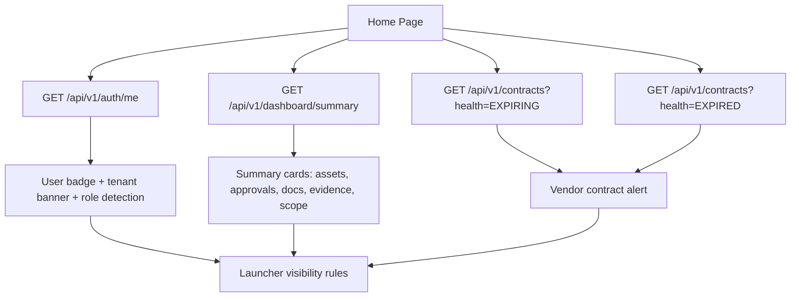

Karakter dashboard:

- Dashboard adalah hub operasional.
- Ia tidak menyimpan data bisnis baru, hanya menampilkan agregasi.
- Banyak launcher di-render hanya kalau role user memenuhi syarat.

## 3. Assets

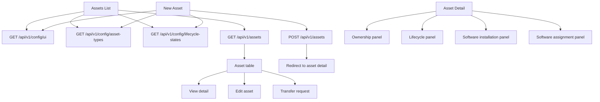

Penekanan business rules:

- Coverage field berubah tergantung asset type.
- Lifecycle transition bisa memicu approval.
- Assets menjadi titik sentral untuk ownership, evidence, contracts, software, dan transfer.

## 4. Approvals

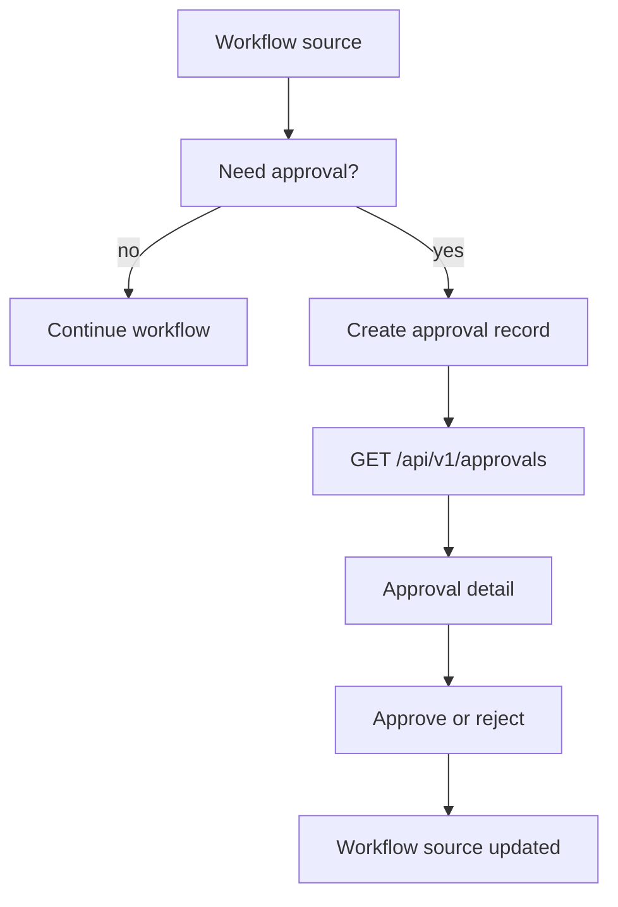

Penjelasan:

- Approvals bukan modul berdiri sendiri dalam arti bisnis; dia adalah gate untuk workflow lain.
- Yang dipantau user biasanya adalah antrian approval dan hasil keputusan.

## 5. Documents

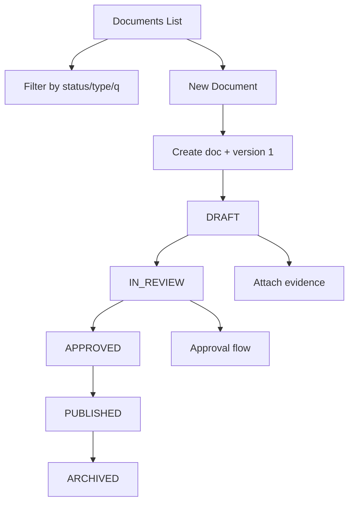

Catatan:

- Dokumen memakai workflow versioning.
- Status menentukan apakah dokumen masih bisa diedit.
- Evidence dan approval menjadi bagian penting dari lifecycle dokumen.

## 6. Evidence

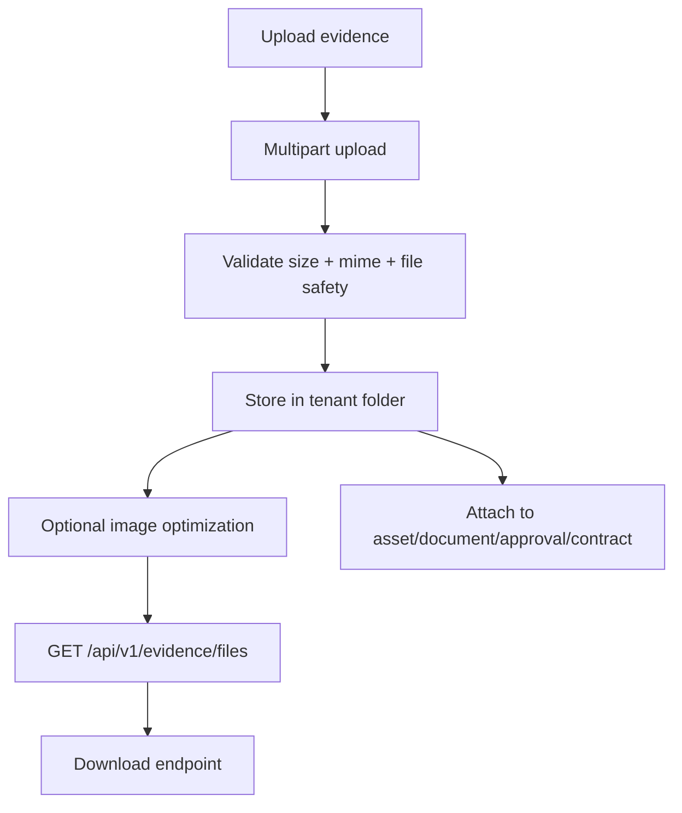

Catatan keamanan:

- File path divalidasi.
- MIME tidak hanya diambil dari ekstensi.
- Upload dibatasi ukuran dan jumlah file.

## 7. Vendors

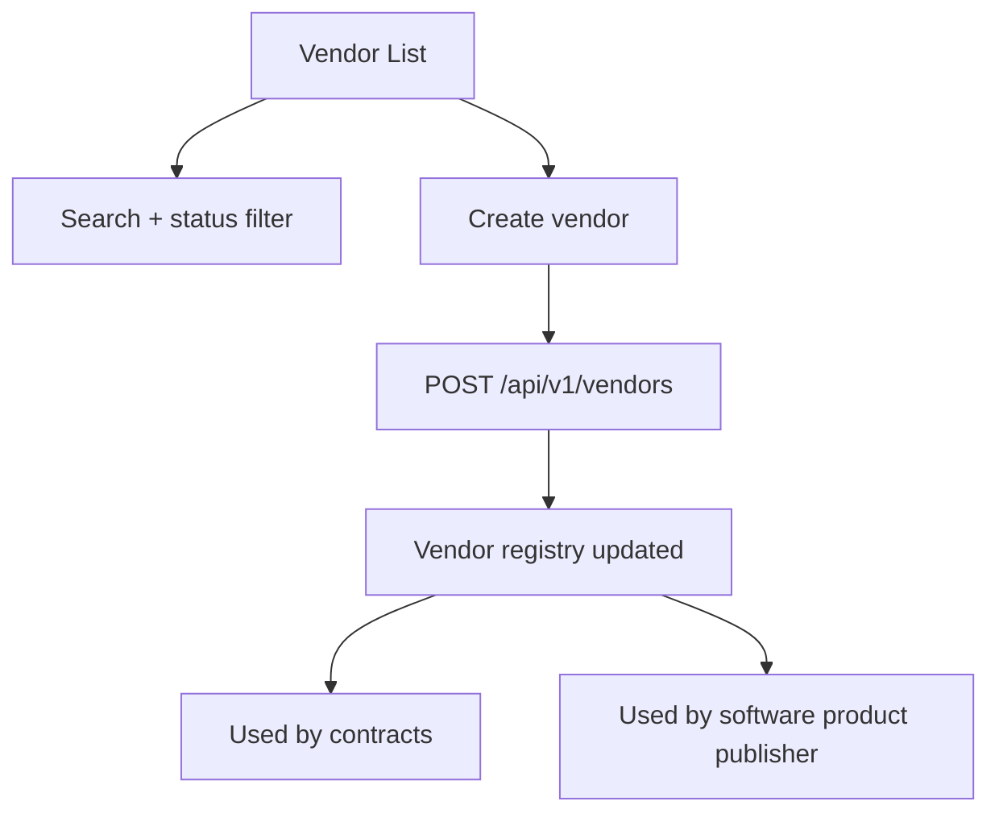

Vendor adalah master data yang dipakai oleh beberapa modul hilir.

## 8. Contracts

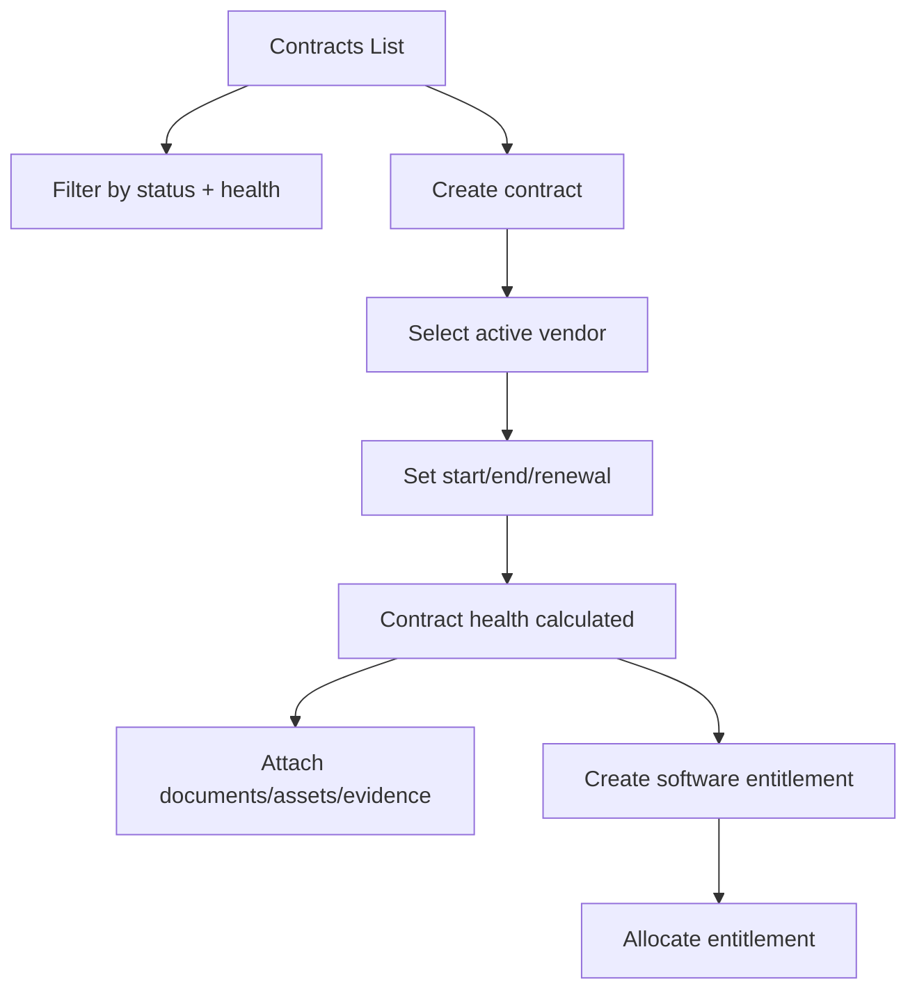

Kondisi yang dihitung backend:

- `ACTIVE`
- `EXPIRING`
- `EXPIRED`
- `NO_END_DATE`

## 9. Software Products, Installations, Assignments, Entitlements, Allocations

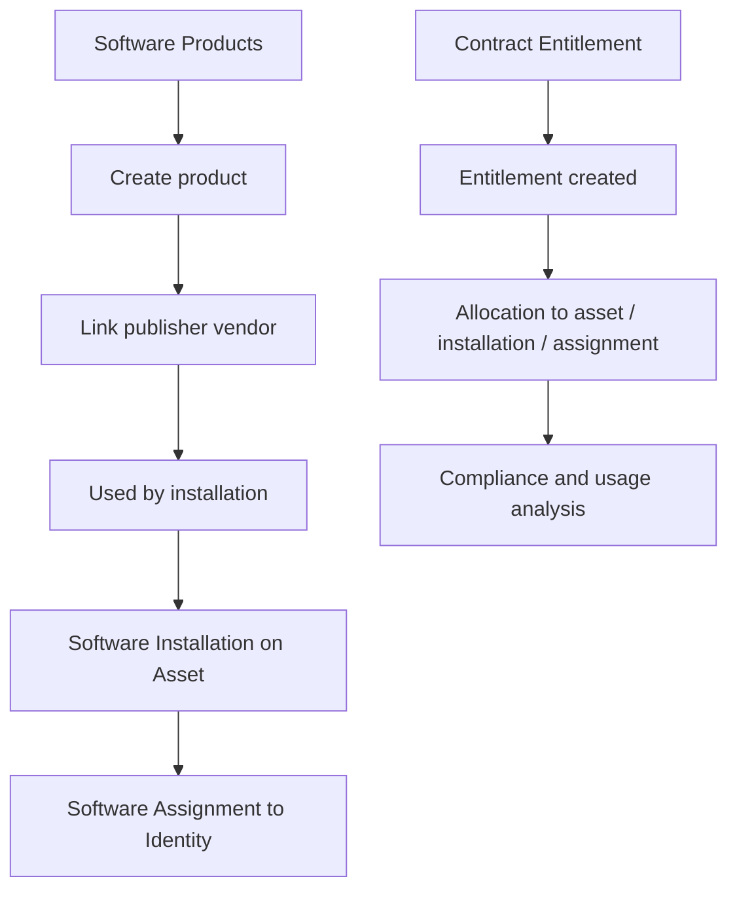

Logika utama:

- Product adalah master software.
- Installation adalah fakta software ada di asset.
- Assignment adalah siapa yang memakai software.
- Entitlement adalah hak lisensi dari kontrak.
- Allocation adalah pembagian hak lisensi ke aset atau pengguna.

## 10. Governance

### 10.1 Scope Versions

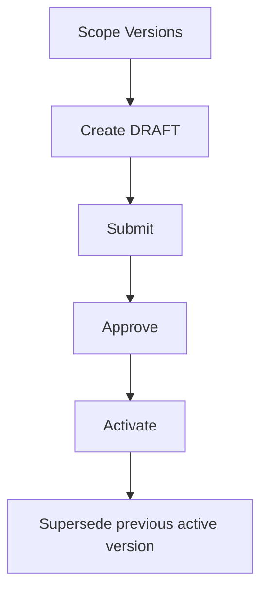

### 10.2 Context Register

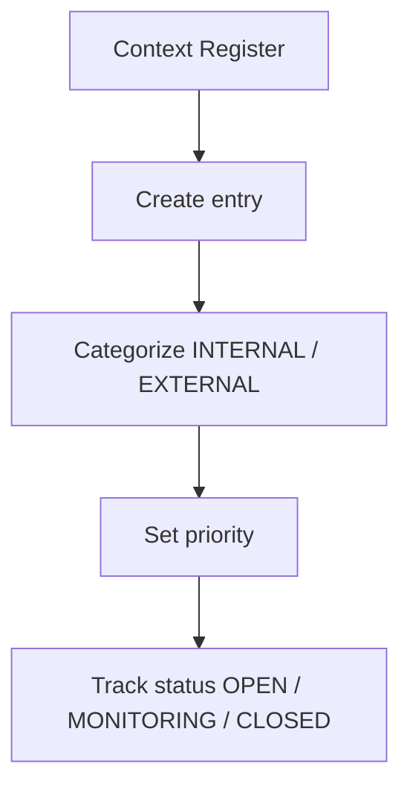

### 10.3 Stakeholder Register

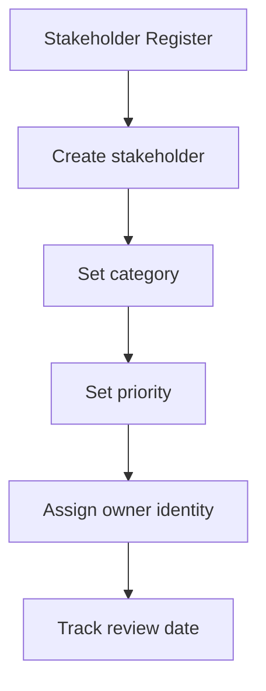

## 11. KPI Workspace

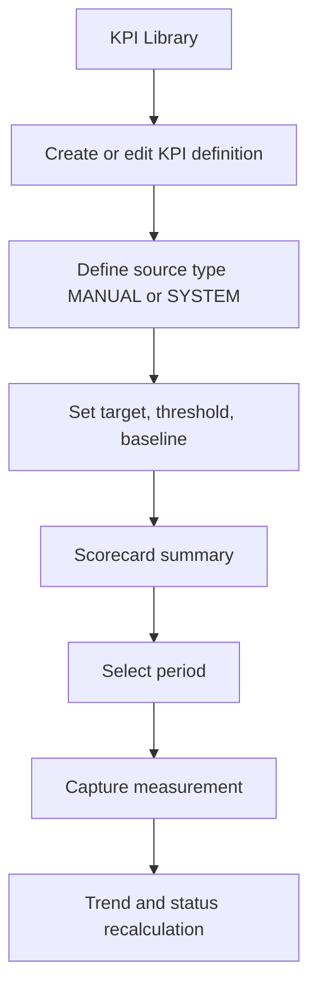

KPI workspace isinya:

- KPI library untuk master data.
- Scorecard untuk monitoring.
- Measurement untuk capture real value.
- Trend untuk melihat pergeseran performa.

## 12. Audit Events dan Internal Audits

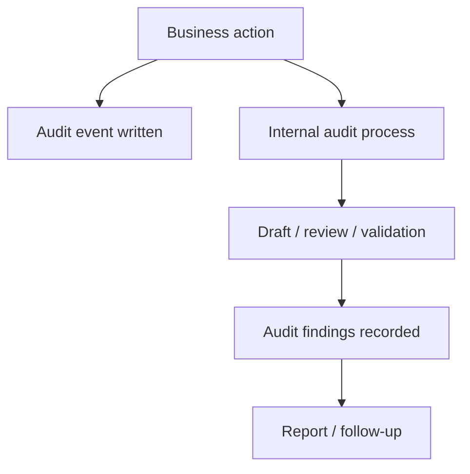

Perbedaan:

- `audit-events` = trail sistem umum.
- `internal-audits` = proses audit internal yang aktif dan terstruktur.

## 13. Superadmin dan Admin Master Data

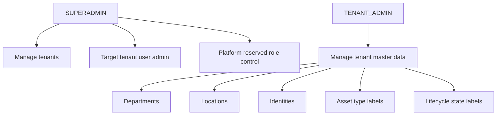

Ringkasan:

- Superadmin mengurus platform dan tenant.
- Tenant admin mengurus master data tenant dan user dalam tenant.

## 14. Reports

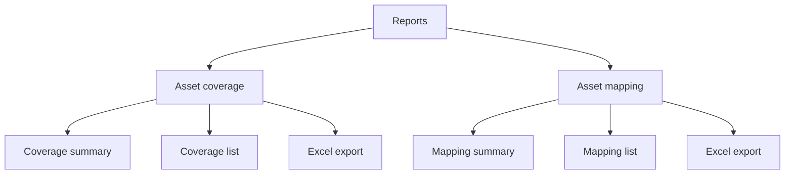

Reports itu read-only dan lebih cocok dipakai untuk monitoring, audit, dan analisis gap.

## 15. Cara Membaca Diagram Ini

- Mulai dari auth dulu kalau ingin memahami sesi dan tenant context.
- Lanjut ke assets kalau ingin memahami core data model.
- Lanjut ke contracts dan software kalau ingin memahami hubungan komersial dan lisensi.
- Lanjut ke governance, KPI, dan internal audits kalau ingin memahami layer kontrol dan pengukuran.

